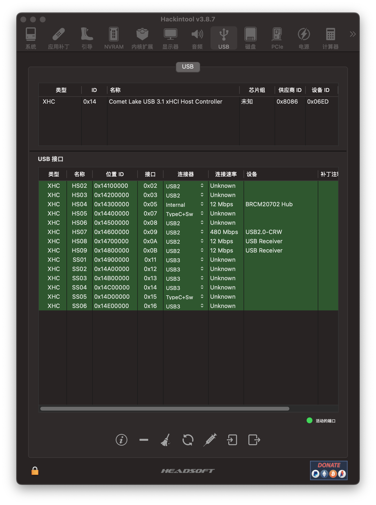

# 	索泰 MAGNUS ONE ZBOX-ECM73070LH Hackintosh

## 配置

  * 处理器: Intel i9-10900T-ES
  * 主板: Intel H470
  * 核显: Intel UHD630
  * 以太网卡1: Killer E3000 2.5 Gigabit Ethernet Controller
  * 以太网卡2: Realtek RTL8168/8111 PCI-E Gigabit Ethernet Adapter
  * 无线网卡/蓝牙: BCM94360NG
  * 声卡: Realtek ALC269
* 独显: 华擎 Radeon RX 5500XT Phantom Gaming 8G OC（仿冒W5500X)
* RAM: 海力士 DDR4-3200 8G×2
* SSD: 海康威视 C2000

## 系统

* iMac20,2
* BootLoad: opencore 0.9.0
* OS: macOS Ventura 13.4 Beta（22F527f）

## BIOS

> Version 2K220617
> [下载地址](https://www.zotac.com/cn/files/download/mini_pcs?driver_type=238&m_pcs_series=179&m_pcs_os=2212&sku=ZBOX-ECM7307LH&skuSelect=ZBOX-ECM7307LH)

## USB定制

## 安装（重要‼️）

1. **下载官网最新的BIOS升级工具.**
2. **解压缩至FAT32格式的U盘，替换由我提供的修改的B440P013.bin文件（已关闭CFG LOCK&VT-d&BAR、DVMT设置64M等）**
3. **重启按F8，选择U盘引导，键盘输入FLASH开始更新**
4. **更新完毕自动重启，按DEL进入BIOS设置，按F9恢复一遍默认设置**
5. **接下来你就可以使用我的EFI文件进行正常黑苹果的安装了**